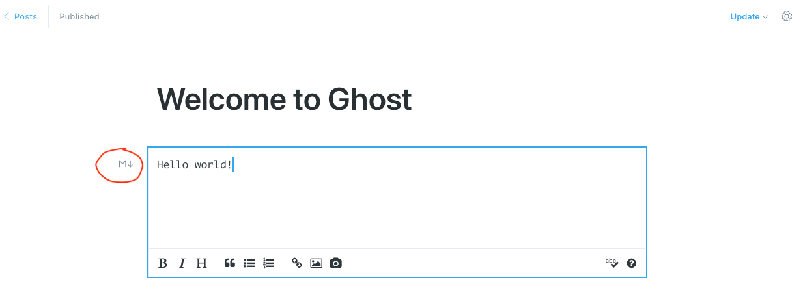
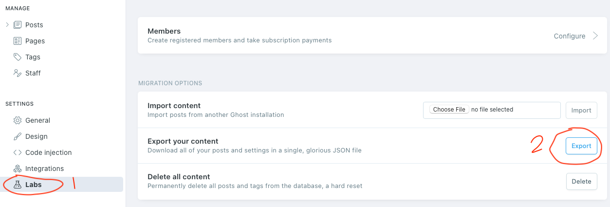

# ghostjson2markdown
Convert ghost content with json format to markdown files


### Requirements

- The content should be written in markdown format, other formats are not supported.

	

- Python


### Usage

- Export your Ghost json file, e.g. `export.json`

	

- Download file `ghostjson2markdown.py`

- Run the code

```
python ghostjson2markdown.py export.json the_folder_you_want_to_place_the_markdown_files
```

### License & Thanks

MIT

Part of the code is obtained from a search on the Internet a few years ago, and I made some improvements, such as support for symbols and errors about utf-8, etc, and currently supports Ghost 1.x-Ghost 3.x.

